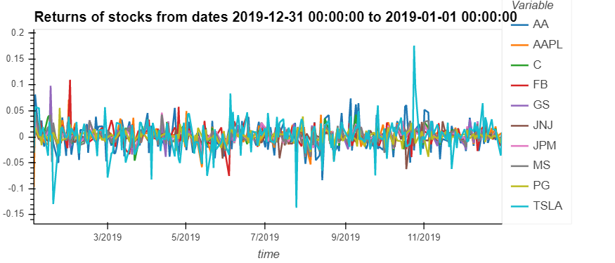
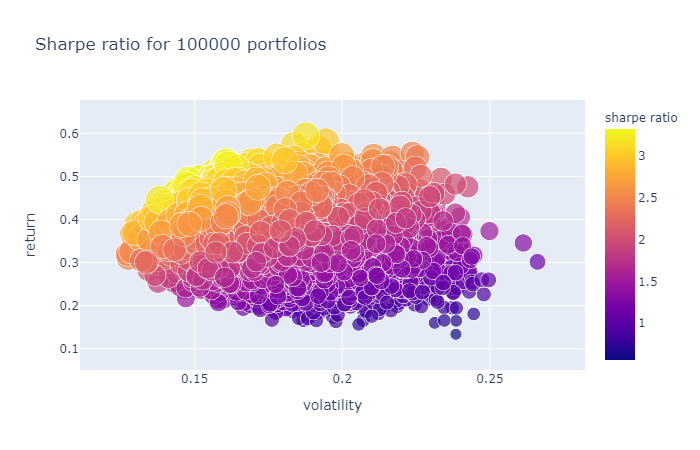
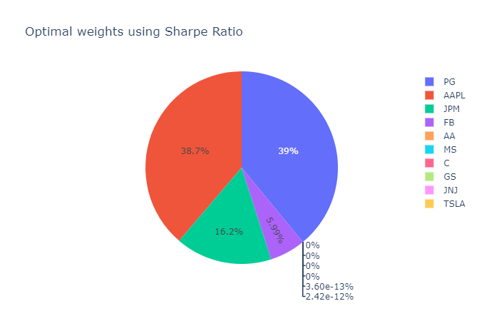
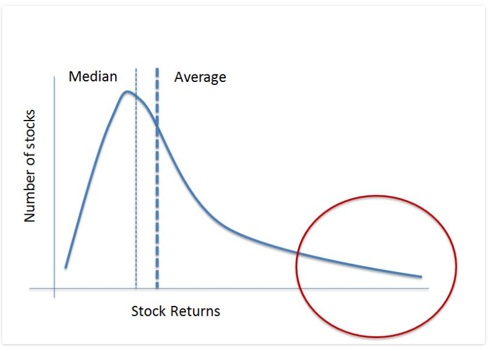
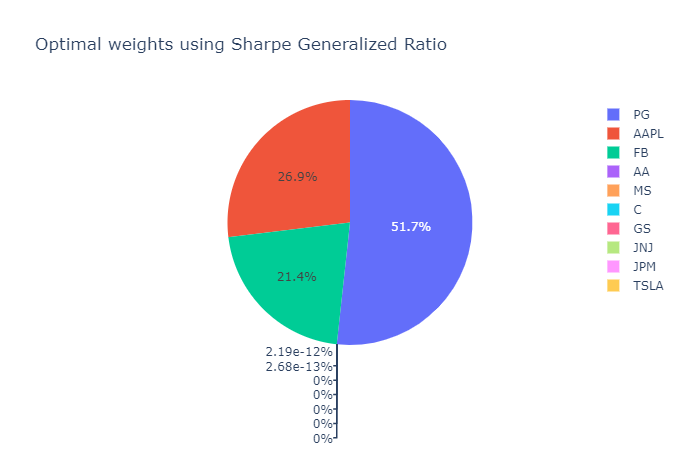
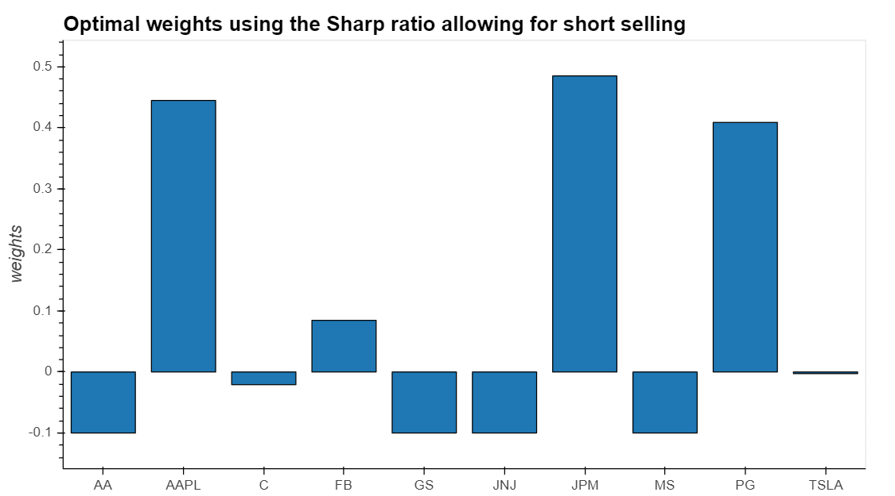
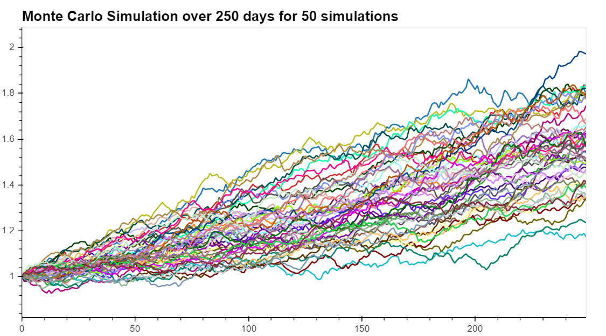
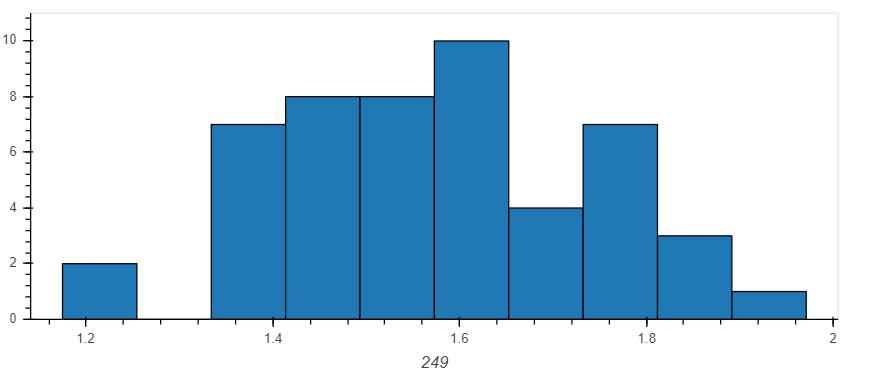

# **Perfecting Portfolios: Optimization and the Efficient Frontier**
*A Python multi-level portfolio optimization analysis by Juan Cajigas, Mindy Bright and Steffen Westerburger* 

## **Optimization: The Art of Making the Best of Anything** 

In this project we use the Python skills we learned in the course so far and apply these to the financial concept of stock portfolio optimization. By using these technical skills tied to a fundamental topic in financial analysis we aim to showcase the strengths and opportunities of FinTech.

The main research question we try to answer is how we can determine the optimal weight distribution of individual stocks within any given portfolio. This is important for several reasons:

- A balanced portfolio provides a greater likelihood for someone to reach their financial goals;
- It democratizes portfolios by enabling investors to pick and choose their preferred stocks;
- It acknowledges that every investor is different and holds different risk profiles.

It is no secret that a lot of research is done on this subject of portfolio management and optimzation. For the sake of time we decided to limit the scope of this project to three main investment optimization theories. We do however realize a more multifaceted analysis is necessary to apply our tools in the real world. 

The cornerstone of our project will use three financial performance indicators:

1. [The Sharpe Ratio](https://www.investopedia.com/terms/s/sharperatio.asp);
2. [The Sortino Ratio](https://www.investopedia.com/terms/s/sortinoratio.asp).
3. [The Generalized Sharpe Ratio](http://citeseerx.ist.psu.edu/viewdoc/download?doi=10.1.1.523.5419&rep=rep1&type=pdf).

 Our optimization efforts will focus on these slightly different criteria to give us a better insight in potential risk and return on investment of our handpicked and personalized portfolios. Subsequently we will plot these simulated optimizations and create an ['Efficient Frontier'](https://www.investopedia.com/terms/e/efficientfrontier.asp) which will give us a better understanding of the relation between portfolio volatility and return. 

 To further show the potential value of these optimization efforts, we will also create a ['Monte Carlo Simulation'](https://www.investopedia.com/terms/m/montecarlosimulation.asp) which is a multiple probability simulation that gives us insight in potential returns of these portoflios over time. This can be a particularly handy tool for any investor to plan for importan milestones/investment strategy.

 --> ADD BRIEF SUMMARY OF FINDINGS

## **A Closer Look: Stock Data and the Alpaca API** 

In order to ensure reliability and validity of our analyses, it is important to focus on the data we use to run our analyses. The backbone of the financial data we use in this project is provided by the [Alpaca API](https://alpaca.markets/algotrading?gclid=EAIaIQobChMIlJu5-_ux6QIVGW-GCh2XRAO9EAAYASAAEgKSHfD_BwE). The use of this API enables us to pull in real-time stock information of all tradeable stocks. 

The information we are interested in is primarily the close price of every tradeable stock per trade day. This raw data gives us the perfect start for our analysis. Another benefit of using the Alpaca API is that the process of data cleaning is straightforward. By simply dropping the columns in our dataframe that we will not be using, a 'clean' and handy dataframe for us to work with is what remains. 

### *Challenges we ran into during the data exploration and clean up process*

Irrespective of the straightforward process of data cleaning, we did face some important data-related questions we needed to answer. Optimization and portfolio analysis heavily relies on accuracy of the underlying data used for these analyses. In other words, it is very important to realize the limitations and characteristics of the pulled in stock data, and more importantly of the covered time span. If, for example, the data only covers a time span in which the overall stock market was overperforming, the outcome of the analysis will be skewed/show overly optimistic outcomes as well. The same is true if the dataset primarly covers a period of economic downturn. It is important to realize the existence of these potential limitations this when interpreting result of our analyses. 

--> ADD INTERESTED FIGURES DEVELOPED DURING EXPLORATION

## **Data Analysis: Sharpe, Sortino, Efficient Frontier and Monte Carlo** 

In this section we will present the framework of our analyses and discuss interesting challanges and outcomes. In order to better understand the code we developed and how it can be used, we would like to walk you through the fictional scenario of investor X. 

The first question investor X will be asked, is to pick the number of stocks he/she would like the portfolio to consist of. After that the user will be asked to specifiy what specific stocks should be included. The tickers of these stocks or subsequently used as in input variable for our Alpaca API resulting in the Dataframe of the handpicked stocks. Also there is a possibilty to specify start and end date of the data that will be used.

--> INSERT PNG OF PORTFOLIO SELECTION

### **The Sharpe Ratio**

The Sharpe Ratio uses annualized cumulative stock returns and the standard deviation of the annualized cumulative stock returns. Basically it determines the average return earned in excess of the risk-free rate per unit of volatility. For example, the yield for a U.S. Treasury Bond could used as a risk-free rate. The higher the value of the Sharpe-ratio, the greater the risk-adjusted return is. 

?? DO WE WANT TO DISCUSS FUNDAMENTAL CODING DECISIONS HERE - FOR EXAMPLE WHY NEG SHARPE?

--> ADD DISCUSSION OF GRAPH, LIMITATIONS ETC

### **The Sortino Ratio**

The Sortino Ratio is a different version of the Sharpe Ratio. Instead of calculating the standard deviation of a stock or portfolio, the Sortino ratio solely focuses on the asset's standard deviation of the negative returns. In other words it is only looking at downside deviation, instead of the total standard deviation (Investopedia) This is a very welcome adjustment of the 'regular' Sharpe-ratio, because investors would generally welcome any upside volatility. The Sortino ratio alleviates punishment for good (upward) risk which is neglected in the Sharpe-ratio.

### **The Generalized Sharp Ratio**
The Sharpe ratio uses only the expected return and volatility of the returns of assets. Investors can also be interested in picking a portfolio with positive skew, that is, a portfolio with a long right hand tail in the distribution. 

.svg.png)

We modify the Sharp ratio by proportionally scaling it with the the skew of returns. A positive skew can be a desired feature as the average return across all the stocks would be greater than the median return. 

--> ADD DISCUSSION OF GRAPH, LIMITATIONS ETC

### **Efficient Frontiers**

The above mentioned ratios can be used in our optimization efforts when we use the results to create the efficient frontier. The efficient frontier is an analysis and representation of optimal internal portfolio weights that would offer the highest expected return for any defined level of risk (Investopedia) These outcomes are dependent on combinations of weights that make up the portfolio. 

- #### **Optimization Routine**
The three ratios we are analyzing are proportional to the expected rate of return and inverse to the volatility of the portfolio. Our goal therefore is to maximize the ratio. To this aim we employ the SciPy python library (https://www.scipy.org/). This is a very powerful scientific computing library that includes modules not only for optimization but also for linear algebra, integration, interpolation, special functions, FFT, signal and image processing, ODE solvers and other tasks common in science and engineering (Wikipedia). From the *opimize* module (https://docs.scipy.org/doc/scipy/reference/tutorial/optimize.html) we selected the Sequential Least SQuares Programming Algorithm (SLSQP). This is the right algorithm for our problem as the objective function (the ratio) is multivariate scalar and the optimization requires one or multiple constraints (portfolio weights and volatility points for the efficient frontier). The routine finds the minimum of the objective so we specified the function as the negative of the ratio. Once the optimum is found we just have to change the sign to obtain the maximum.   

We minimize the negative of the ratio subject to the condition that the sum of weights equals one. We don't allow for short selling so the bounds of the parameters (weights) are defined by the set [0,1]. Each point of the efficient frontier is the maximum ratio subject to a specific volatility level. So for the construction of the frontier, we loop over a set of optimization routines where besides the sum of weights constraint we add another one for the volatility level.

--> ADD PNG OF GRAPH

--> ADD DISCUSSION OF GRAPH, LIMITATIONS ETC
### **Allowing for short-selling**

### **Monte Carlo Simulation**

The Monte Carlo simulation is a multiple probability simulation that is often used for financial analysis. It used to model probability of different outcomes that would otherwise be difficult to predict because of the interference of uncertain variables such as return rates (Investopedia). This uncertainty is adressed by using a simulation of multiple different potential values for any variable (based on historic information) rather than just using a single value. 

--> ADD PNG OF GRAPH

--> ADD DISCUSSION OF GRAPH, LIMITATIONS ETC

## **Discussion of Findings**

## **Postmortem**

--> WHAT DIFFICULTIES DID WE HAVE

--> WHAT ELSE WOULD WE HAVE DONE WITH TWO MORE WEEKS 

